# (Temporary) Portfolio 📚

Most of my publicly available work is listed here.  
You can hover each project to get more informations and click on them to either browse the online site if available or have a better preview.

-   ## 🎨💻 Design + Development

<a href="https://lumkinevision.fr/" title="Lumkine Vision - Astro, Tailwind CSS, Decap CMS">
    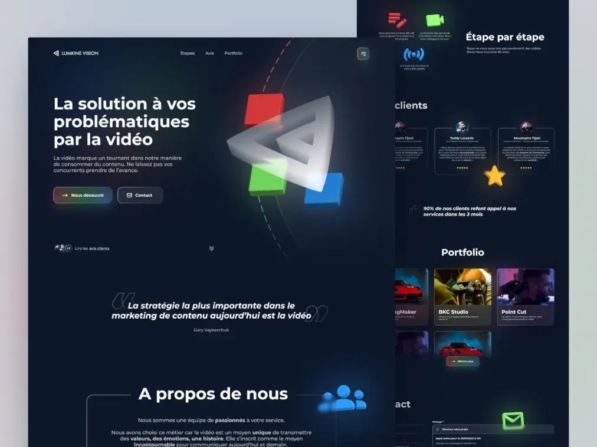
</a>
<a href="https://meditationartdelarelation.fr/" title="Meditation Art de la Relation - Astro, Tailwind CSS">
    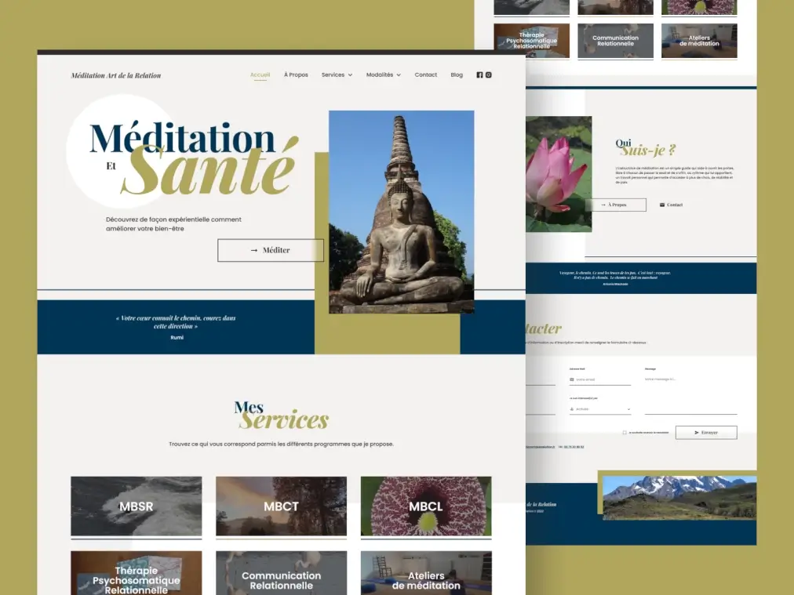
</a>
<a href="https://raw.githubusercontent.com/zathio/zathio/master/portfolio/international-sos.webp" title="International SOS | Form Page - HTML, CSS, Javascript">
    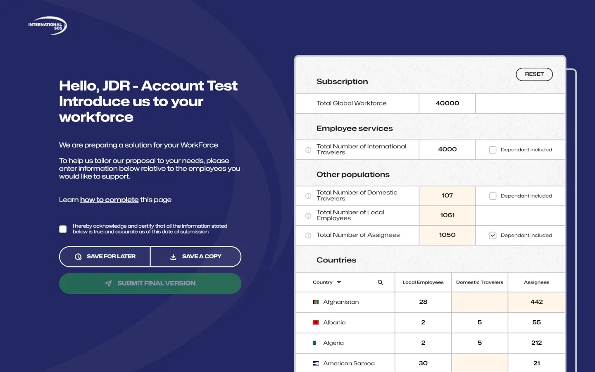
</a>
<a href="https://raw.githubusercontent.com/zathio/zathio/master/portfolio/road-rider-world.gif" title="Road Rider World | Language Page - Sass (Scss)">
    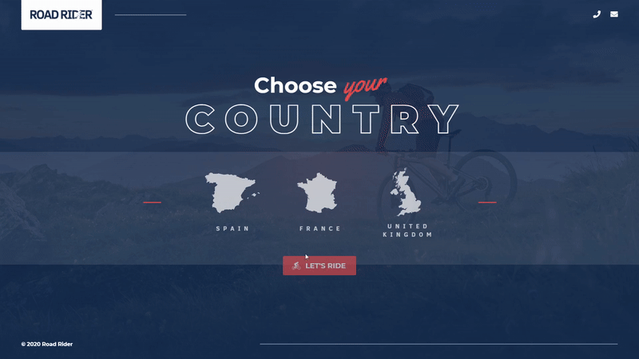
</a>

-   ## 💻 Front-end Development
<a href="https://sobioda.com/" title="Sobioda - Sass, Twig, Symfony">
    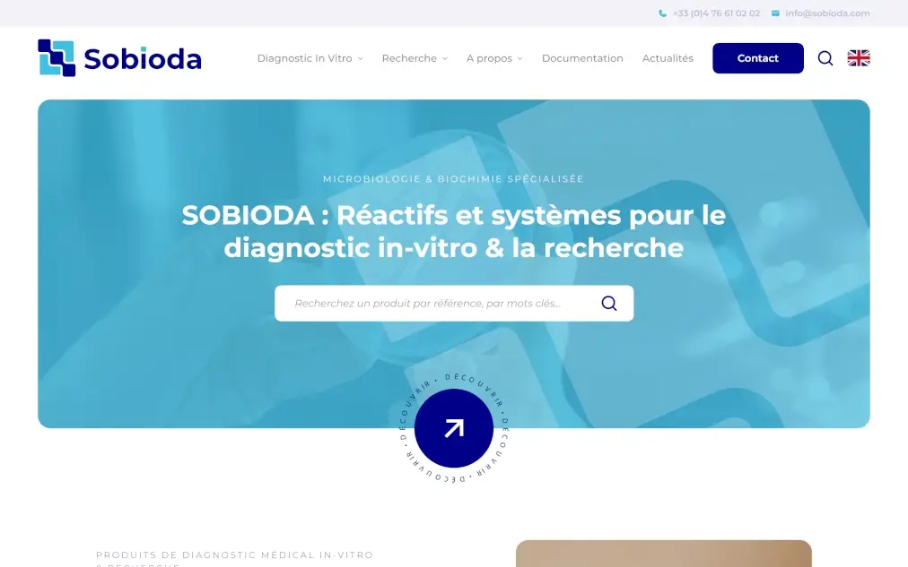
</a>
<a href="https://www.aerolux-sas.fr/" title="Aerolux - Sass, Twig, Symfony">
    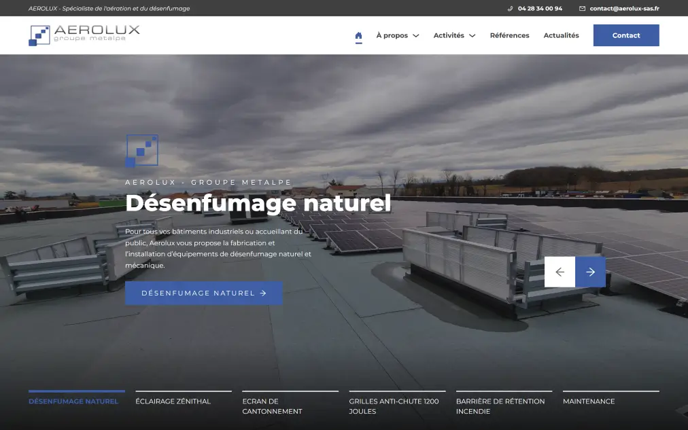
</a>
<a href="https://raw.githubusercontent.com/zathio/zathio/master/portfolio/abc-borne_full.webp" title="ABC Borne - Sass, Twig, Symfony">
    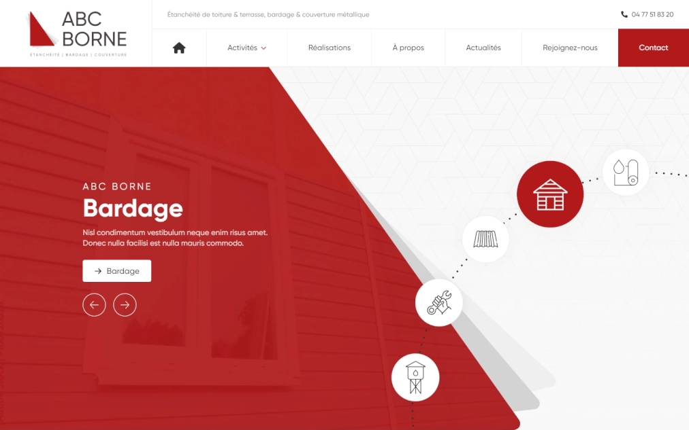
</a>
<a href="https://www.restaurantlasignoria.com/" title="Restaurant La Signoria - Astro, Tailwind CSS, Directus">
    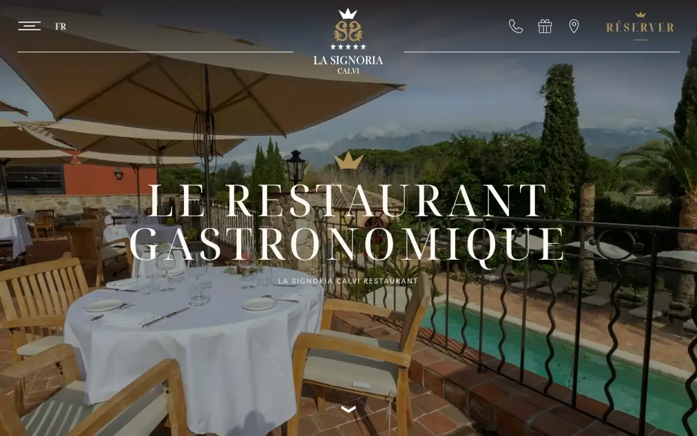
</a>
<a href="https://www.mapak.io/" title="Mapak - HTML, CSS, Javascript">
    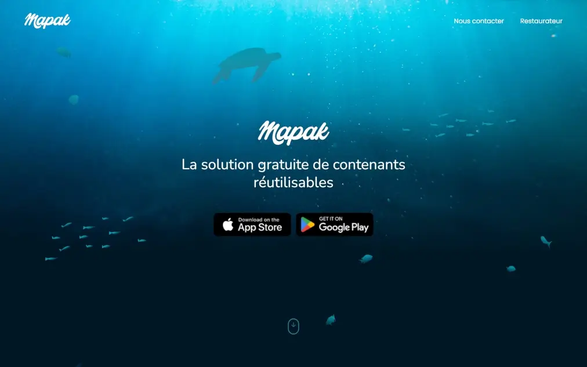
</a>

<a href="https://raw.githubusercontent.com/zathio/zathio/master/portfolio/what-the-fluff_full.jpg" title="What The Fluff - HTML, CSS, Javascript">
    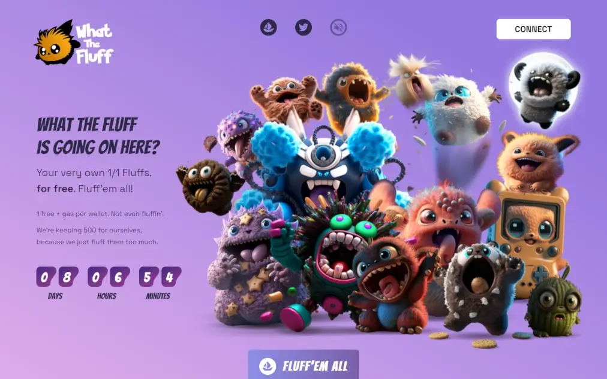
</a>
<a href="https://www.lesateliersduphil.net/" title="Les Ateliers Duphil - Sass (Scss)">
    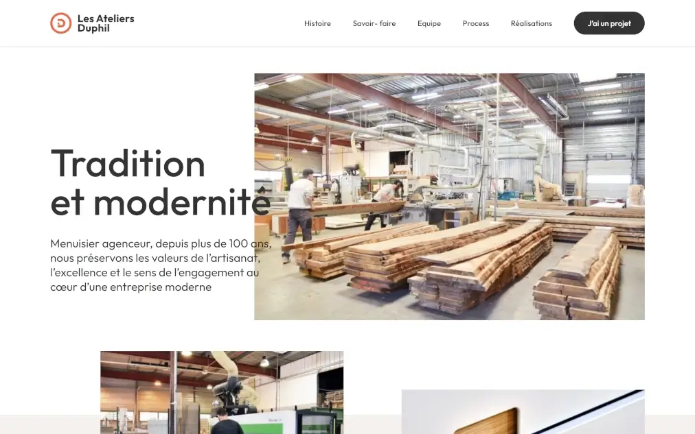
</a>
<a href="https://simonekleindesign.online/" title="Simone Klein Portfolio - Tailwind CSS, Vite">
    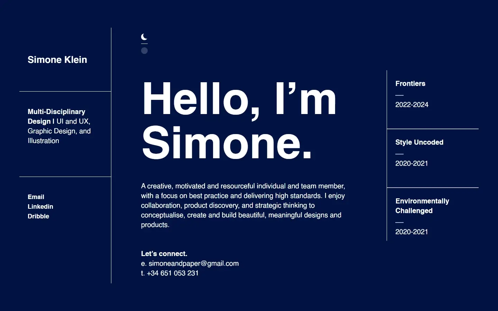
</a>
<a href="https://www.garder-mes-enfants.fr/baby-sitter/marseille.html" title="Garder mes enfants - HTML, CSS, Javascript">
    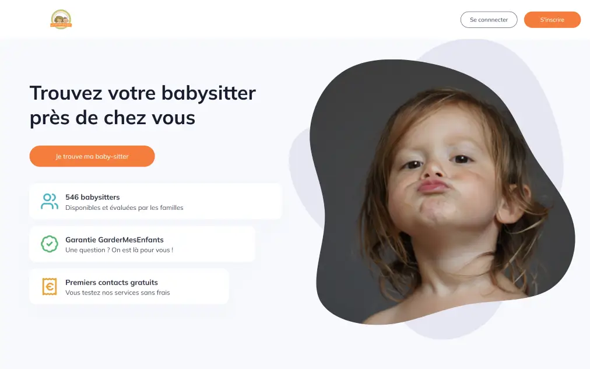
</a>
<a href="https://raw.githubusercontent.com/zathio/zathio/master/portfolio/ouistity.webp" title="Ouistit'y - Vanilla CSS">
    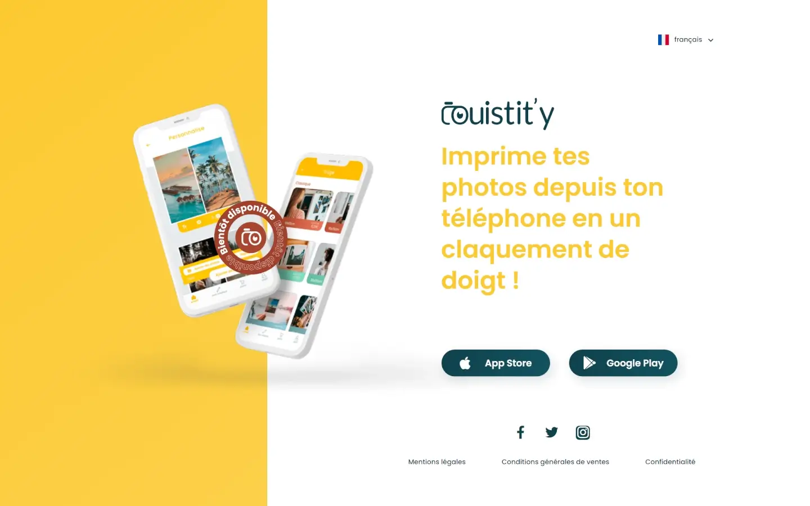
</a>
<a href="https://raw.githubusercontent.com/zathio/zathio/master/portfolio/livo-agency.webp" title="Livo Agency - Sass (Scss)">
    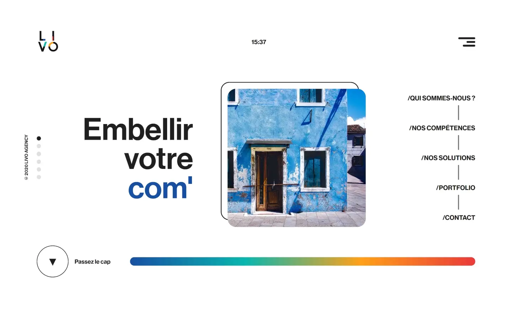
</a>

<a href="https://app.lesiteduparent.com/" title="Le Site du Parent - Sass (Scss)">
    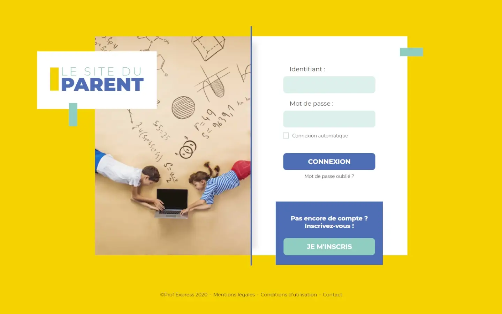
</a>
