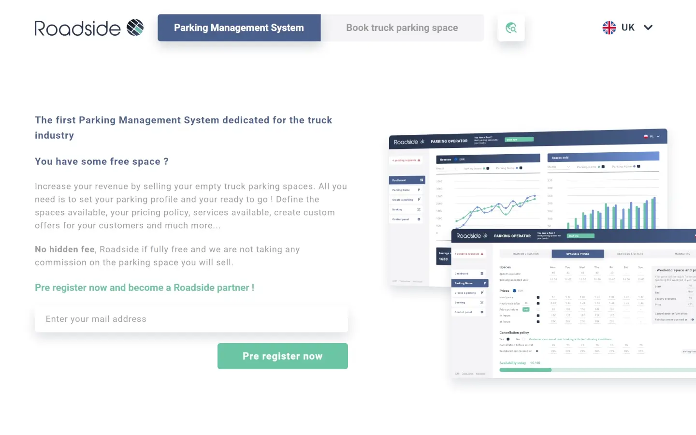

# (Temporary) Portfolio 📚

Most of my publicly available work is listed here.  
You can hover each project to get more informations and click on it to either browse the online site if available or have a better preview.

-   ## 🎨💻 Design + Development

-   ## 💻 Front-end Development

